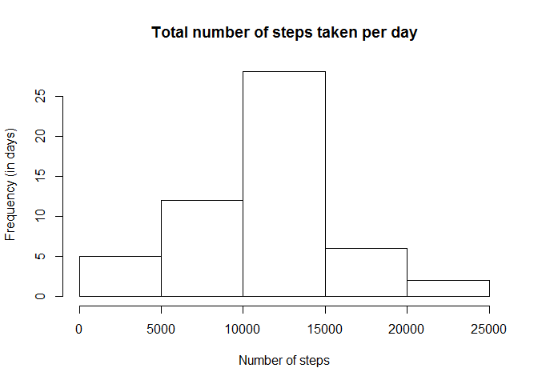
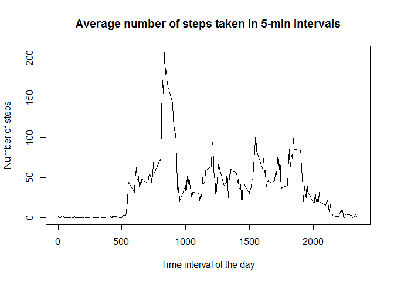

## Loading and preprocessing the data


```r
# Load the data set...
url = "https://d396qusza40orc.cloudfront.net/repdata%2Fdata%2Factivity.zip"
download.file(url, "temp.zip")
unzip("temp.zip", exdir = "data") 
file.remove("temp.zip")
fitdata <- read.csv(file = "data/activity.csv", header=TRUE)

# Convert the date column to dates
fitdata$date <- as.Date(fitdata$date)
fitdata$time <- substr(as.POSIXct(sprintf("%04.0f", fitdata$interval), format='%H%M'), 12, 16)
fitdata$datetime <- as.POSIXct(paste(fitdata$date, time=fitdata$time), format = "%Y-%m-%d %H:%M")
```

## What is mean total number of steps taken per day?

Let's calculate the total number of steps taken per day and mean/median of them.


```r
# Use the aggragate function for that
stepsbyday <- aggregate(steps ~ date, fitdata, sum)
hist(stepsbyday$steps, main = "Total number of steps taken per day", xlab = "Number of steps", ylab = "Frequency (in days)")
```

<!-- -->

```r
# Calculate the mean and median 
meansteps <- round(mean(stepsbyday$steps, na.rm=TRUE), 0)
mediansteps <- round(median(stepsbyday$steps, na.rm=TRUE), 0)
```

The mean total number of steps taken per day is  **10766**  
The median number of steps is  **10765**


## What is the average daily activity pattern?

In this question we want to know what is an average activity pattern during a day.


```r
# Calculate the average steps for each interval. Use the aggragate function for that
stepsbyinterval <- aggregate(steps ~ interval, fitdata, mean)

# Plot the average numbers
plot(stepsbyinterval$interval, stepsbyinterval$steps, type="l", main = "Average number of steps taken in 5-min intervals", xlab = "Time interval of the day", ylab = "Number of steps")
```

<!-- -->

```r
# Let's see what is the most active period in general
maxinterval <- which.max(stepsbyinterval$steps)
maxtime <- stepsbyinterval$interval[maxinterval]
maxactive <- substr(as.POSIXct(sprintf("%04.0f", maxtime), format='%H%M'), 12, 16)
```

People are most active around **08:35** on the morning, when they wake up.


## Imputing missing values


```r
numberna <- sum(is.na(fitdata$steps))
```

In the original data set there are **2304** missing values.

I advise to fill the missing values with the mean of that interval. 
We create a new data set and fill in the missing values with that.

```r
fitdata2 <- merge(fitdata, stepsbyinterval, by="interval", sort = FALSE, suffixes=c("","_mean"))
nodata <- is.na(fitdata2$steps)
fitdata2$steps[nodata] <- fitdata2$steps_mean[nodata]
```

Let's re-calculate and re-plot the total number of steps taken per day.


```r
# Use the aggragate function for that
stepsbyday2 <- aggregate(steps ~ date, fitdata2, sum)
```


```r
hist(stepsbyday2$steps, main = "Total number of steps taken per day", xlab = "Number of steps", ylab = "Frequency (in days)")
```

<!-- -->

```r
# Calculate the mean and median 
meansteps2 <- round(mean(stepsbyday2$steps, na.rm=TRUE), 0)
mediansteps2 <- round(median(stepsbyday2$steps, na.rm=TRUE), 0)
```


The new mean total number of steps taken per day is  **10766**  
The new median is  **10766**

Conclusion: if we impute the missing values that **does not change the result** significantly, the impact is minimal.

## Are there differences in activity patterns between weekdays and weekends?

For each observation we calculate if a data is a weekday or weekend.


```r
# We calculate if a data is a weekday or weekend 
Sys.setlocale("LC_TIME", "C")
```

```
## [1] "C"
```

```r
weekdays <- c("Monday", "Tuesday", "Wednesday", "Thursday", "Friday")
weekends <- c( "Saturday" , "Sunday")

fitdata2$weekday[weekdays(fitdata2$date) %in% weekdays] <- c("weekday")
fitdata2$weekday[weekdays(fitdata2$date) %in% weekends] <- c("weekend")
fitdata2$weekday <- as.factor(fitdata2$weekday)

# Calculate the average steps for each interval. Use the aggragate function for that
stepsbyinterval2 <- aggregate(steps ~ interval + weekday, fitdata2, mean)

# Plot the average steps in different intervalls
library(lattice)
xyplot(  steps ~ interval | weekday, stepsbyinterval2 , type = "l", main="Average number of steps taken in 5-min intervals", ylab="Number of steps", xlab="Intervals during the day")
```

<!-- -->

Conclusion: during weekdays people are more active on the mornings (when tey go to work or school) but afterwards they do not move that much, maybe sitting more at their desks. During weekends they do more activities.
